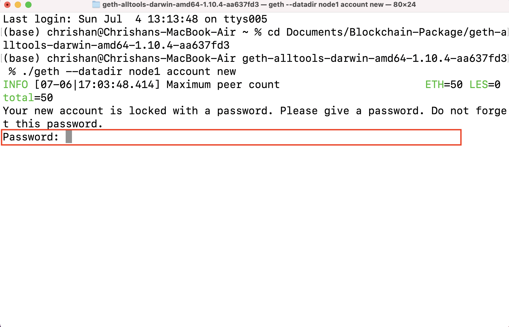
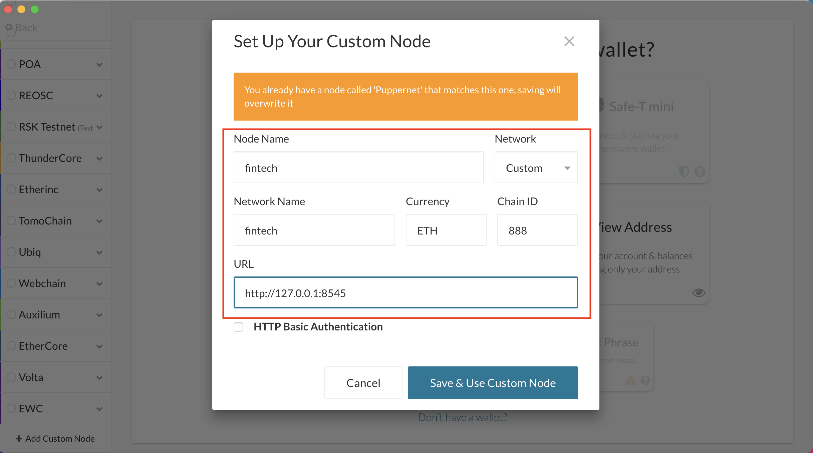

# Unit 18 - Proof of Authority Development Chain

## Objective
To set up testnet blockchain for ZBank through the following four deliverables:
- Set up custom testnet blockchain
- Send a test transaction
- Create a repository
- Write instructions on how to use the chain for the rest of my team

---

## Preliminary Setup

1) Download Go Ethereum Tools - Navigate to https://geth.ethereum.org/downloads/ and download the most recent stable version of 'Geth & Tools' for your operating system:

---

2) Unzip geth folder:

---

3) Download MyCrypto - Navigate to https://app.mycrypto.com/download-desktop-app and download for your operating system.

---

## Setup custom out-of-the-box blockchain

1) Open Terminal and navigate into the unzipped geth & tools folder:

---

2) Create First Node - We will need at least 2 nodes to create a blockchain.  To create node 1, execute command: 
    <pre>./geth --datadir node1 account new</pre>

---

3) Node 1 Password - Nodes require password to access them in order to transact. You will be prompted to enter a password.  Select any password you'd like and make note of it.

---

4) Node 1 Public Address - After setting your password, node 1 will have been created and its public address of the key will be displayed.  Copy this.

    Paste the public address in a text file for future reference.

---

5) Create Second Node - To create the second node, execute command:
<pre> ./geth --datadir node2 account new</pre>

---

6) Node 2 Password - You will be prompted again to create a password, this time for node 2.  Enter and reenter it in.

---

7) Node 2 Public Address - Node 2's public address will be displayed.  Copy this.

    Paste Node 2's public address in the text file you have created for future reference.

---

8) Ethereum Private Network Manager - In order to create your blockchain, you must launch puppeth, which is your network manager.  Execute command:
<pre>./puppeth</pre>

---

9) Name Your Network - Give the network a name.  In this case, I've named it 'fintech':

---

10) Configure New Genesis - Enter in option 2:

---

11) Create New Genesis from Scratch - Enter in option 1:

---

12) Select Consensus Engine - We are using 'Clique - proof-of-authority'. Enter in option 2:

---

13) Block Time - The block time is the time required to create the next block in a chain.  We can specify it for the genesis block.  It cannot be changed after. I chose to use the default time of 15 seconds by just hitting enter:

---

14) Allow Accounts to Seal - Paste in the public addresses of nodes 1 and 2 that we recorded in our text file:

---

15) Prefunding - Paste the public addresses of nodes 1 and 2 to be prefunded.

    Say no to wei:

---

16) Chain ID - A chain ID is used to prevent replay attacks between the main ETH and other chains.  It is an additional way of telling chains apart. At this stage, you will now be prompted to enter in a chain ID.  You may choose anything you'd like.  I have used '888':

---

17) Manage Existing Genesis - You must now enter in option 2:

---

18) Export Genesis Configuration - Enter in option 2:

---

19) Choose Folder for Genesis Specs - Select the default (current) folder by hitting enter:

---

20) Puppeth Configuration - Here we can see the json files that have been saved. 'fintech.json' and 'fintech-harmony.json':

---

21) Delete Fintech-Harmony.json - We only need the 'fintech.json' file, so we can go into Finder and delete 'fintech-harmony.json':

---

22) Kill Process - We are now getting ready to initialize our nodes.  But first we must kill the current process using ctrl + c:

---

23) Initialize Node 1 - In order to initialize node 1, execute command:
<pre>./geth init fintech.json --datadir node1</pre>:

---

24) Initialize Node 2 - Now initialize node 2 by executing command:
<pre>./geth init fintech.json --datadir node2</pre>

---

25) Launch Node 1 - Now that the two nodes have been initialized, we are ready to launch node 1. There are several flags we will include in the code:
- The '--unlock' flag allows us to send transactions from node 1, otherwise by default it is locked.  
- The '--mine' flag tells the node to mine new blocks. 
- The '--rpc' flag enables us to talk to our second node, which will allow us to later use MyCrypto to transact on our chain.
- The '--syncmode=full' flag makes your machine initialize a local copy of the Ethereum Virtual Machine in its original clean state, downloads every block since the beginning of the blockchain, and executes every transaction in every block which updates the EVM to its present-day state.
- The '--snapshot=false' flag are to turn off snapshots.  Snapshots are an acceleration data structure on top of the Ethereum state that allows reading accounts and contract storage to be done faster. Disabling it prevents instability that could be caused by this feature. 
- The 'allow-insecure-unlock' flag fixes the error that you receive when you try to access the node with geth via HTTP protocol

To launch node 1, execute command:
<pre>./geth --datadir node1 --unlock "Node 1 public address" --mine --rpc --syncmode "full" --snapshot=false --allow-insecure-unlock</pre>

---

26) Copy Enode Address of Node 1 - After launching node 1, scroll up in the executed code to find the enode address.  Copy the entire thing:

Paste the enode address in your text file:

---

27) Launch Node 2 - First, open a new Terminal window, but don't close the first one:

To launch node 2, execute command:
<pre>./geth --datadir node2 --port 30304 --bootnodes "enode://enter enode address"</pre>

Our blockchain is now live!

---

## Send a Transaction

1) Create Custom Node - Open MyCrypto and click on 'Add Custom Node' on bottom right corner of window:

---

2) Custom Node Settings - Enter in a name for both Node Name and Network Name.  I have used 'fintech'. 

Enter 'ETH' for the Currency. 

Select 'Custom' for Network. 

Enter in the Chain ID you used earlier.  I used '888'.

Enter in 'http://127.0.0.1:8545' for URL.

Click 'Save & Use Custom Node'

---

3) Access Wallet - Click 'Keystore File' to access our wallet:

---

4) Unlock Keystore - Click 'Select Wallet File':

---

5) Select Node 1 Keystore File - In the file browser, navigate to the node 1 folder within the geth folder you downloaded.  Within the node 1 folder, navigate into the keystore folder and select the keystore file in there:

---

6) Enter in Password - Enter in the password you initially set for node 1.  Click 'Unlock':

---

7) Send ETH - After unlocking your wallet, you will see inputs to send ETH.  Enter in node 2's public address into 'To Address' field.  Enter in the amount.  I have used '888'.  Select 'ETH' as the currency.  Click 'Send Transaction':

---

8) Confirm Transaction - Verify the transaction details, and if correct, click 'Send':

---

9) Check Transaction Status - After sending your transaction, a green banner will appear at the bottom of the window informing you of the transaction you have sent.  It contains a button called 'Check TX Status'.  Click that to view your recently made transaction:

It will warn you that you are about to logout, click 'logout':

---

10) Transaction Status - On this page you will see the transaction status of the transaction you have just completed.  As you can see here, it is still pending.  Once the transaction has been verified and added to the blockchain, the status will show it as completed:

# Successs! Transaction complete!